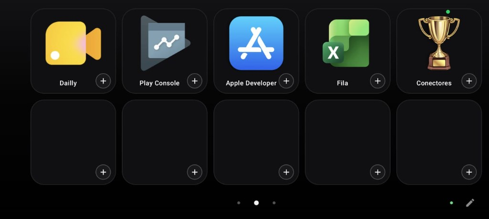
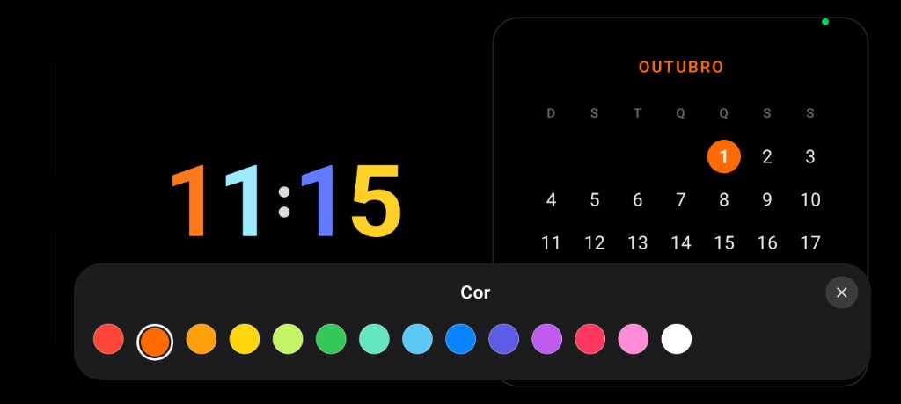
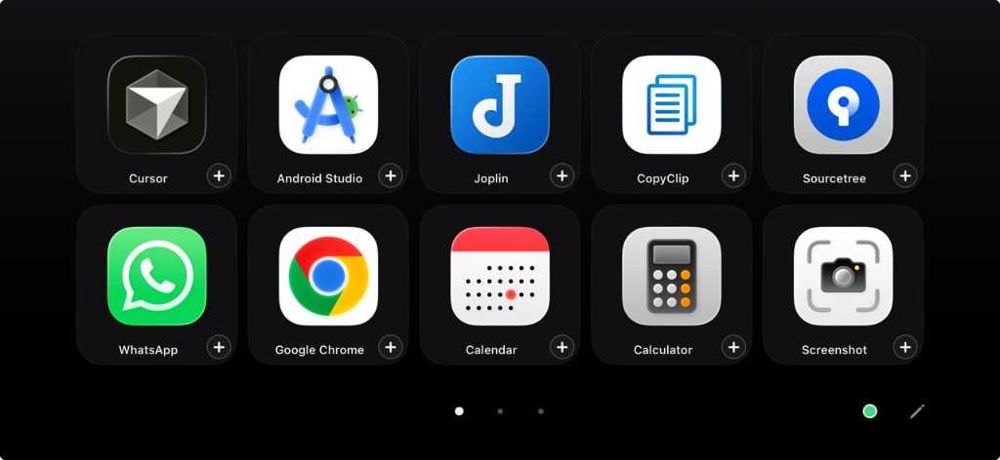
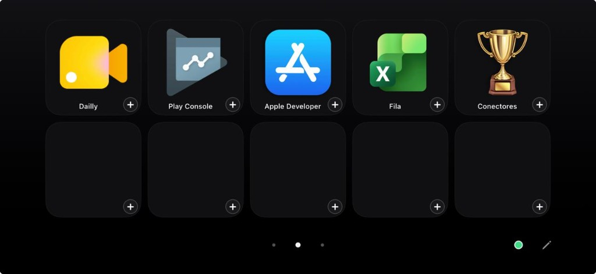
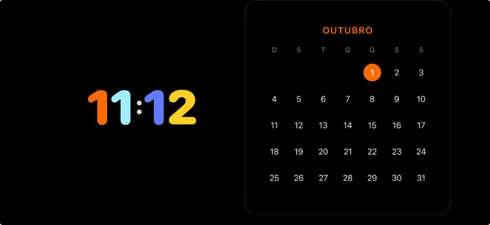
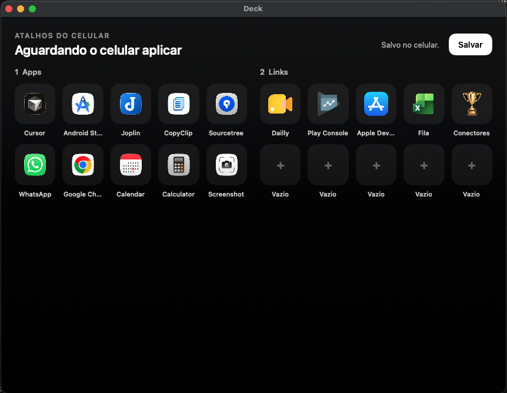

# Deck

Stream deck no celular para controlar o Mac. O telefone mostra as teclas. O notebook lista os aplicativos, envia os ícones e abre o que foi tocado.

O mesmo deck existe no Android e no iPhone. No Mac, um app acompanha a conexão, edita os atalhos e mantém o serviço ligado sem o Terminal aberto.

## Ambientes

### Android

| Atalhos | Links | Relógio |
| --- | --- | --- |
|  |  |  |

### iPhone

| Atalhos | Links | Relógio |
| --- | --- | --- |
|  |  |  |

### Mac



## O que o celular faz

- Dez teclas com o ícone real de cada app do Mac. O **+** vincula ou troca o app.
- Uma segunda página de links, abertos no navegador padrão do Mac.
- Uma terceira página com relógio colorido e calendário, em fundo preto. A cor do relógio pode ser trocada. O calendário volta para o mês atual ao sair e voltar.
- Segurar uma tecla reposiciona. Um toque curto abre.
- O lápis troca a imagem da tecla. Os pontos de baixo mudam de página.
- O ponto de conexão liga o celular ao notebook. Os dois precisam estar na mesma rede Wi-Fi.

No Mac, o app mostra os atalhos que estão no celular, permite editá-los e salvar, inclusive os ícones.

## Como rodar

### Mac

O app do Mac sobe o serviço sozinho e fica na barra de menus.

```bash
bash mac/build.sh
```

Isso gera o Deck, instala em `/Applications` e fixa no Dock. Na primeira vez, as ferramentas de linha de comando do Xcode precisam estar instaladas (`xcode-select --install`).

Para subir só o serviço, sem a janela:

```bash
python3 companion/server.py
```

No macOS também vale dois cliques em `companion/Iniciar.command`. O endereço e o código de 6 caracteres aparecem no app do Mac, ou no terminal se o serviço foi iniciado por ali. O código fica só na máquina e não entra no repositório.

### Android

Abra a pasta `android` no Android Studio e rode o app Deck. Android 8 ou mais novo.

### iPhone

Abra `ios/Deck.xcodeproj` no Xcode e rode o scheme Deck. iOS 17 ou mais novo. Em um iPhone físico, escolha o seu time de desenvolvimento na assinatura do projeto.

Na primeira tela, informe o endereço do Mac e o código.

## Projeto

```
android/      Kotlin e Jetpack Compose
ios/          SwiftUI
mac/          SwiftUI, app de menu e janela
companion/    serviço em Python 3 na porta 8765
```
